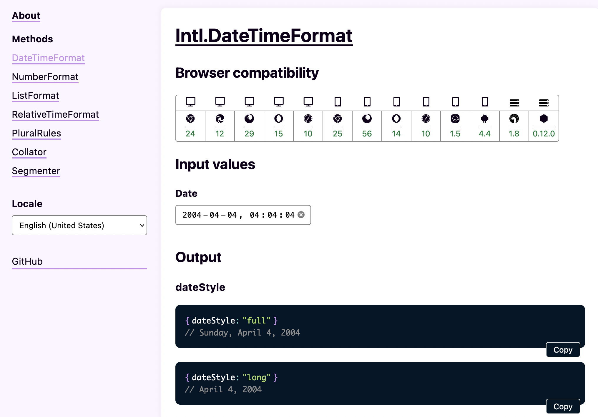

# DateTimeFormat Explorer

This is a tool for viewing output for all possible format options for [Intl.DateTimeFormat](https://developer.mozilla.org/en-US/docs/Web/JavaScript/Reference/Global_Objects/Intl/DateTimeFormat). Built with [Svelte](https://svelte.dev/).

## Live site

**[https://jesperorb.github.io/datetimeformat-explorer/](https://jesperorb.github.io/datetimeformat-explorer/)**

## Running

1. Install dependencies: `npm install`.
2. Run devserver: `npm run dev`.
3. Visit: [https://localhost:5000](https://localhost:5000).

## Building

1. Run command: `npm run build`.

## Deploying

_Assuming code has been pushed to GitHub as it uses `gh-pages`._

1. Run command: `npm run deploy`.
